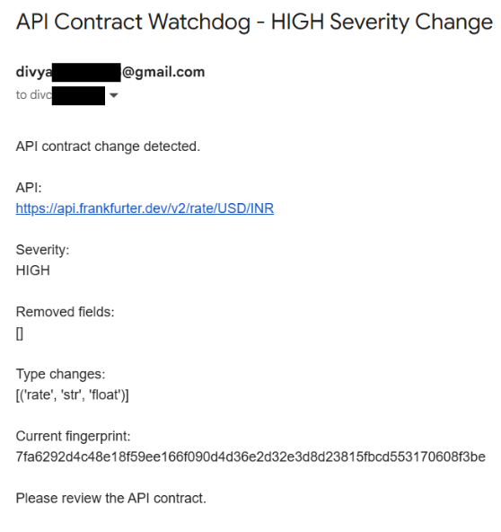

# API Contract Watchdog

> **V3 Model — Production-Ready API Contract Monitoring**

A Python-based monitoring system that detects API response structure changes before they silently break dependent applications.

---

## Problem

APIs can return `HTTP 200 OK` while their response structure changes.

For example, an API may initially return:

```json
{
    "rate": 95.42,
    "date": "2026-09-11"
}
````

but later change to:

```json
{
    "exchange_rate": 95.42,
    "date": "2026-09-11"
}
```

The API is still technically available, but applications expecting `rate` can fail.

**API Contract Watchdog detects these contract changes automatically.**

---

## V3 Features

* Fetches JSON data from a configurable API endpoint
* Handles request timeouts and API errors
* Extracts nested JSON structures
* Detects fields inside arrays
* Generates SHA-256 schema fingerprints
* Compares the current contract against a stored baseline
* Detects added, removed, and type-changed fields
* Classifies changes by severity
* Maintains local change history
* Sends email alerts for HIGH-severity changes
* Prevents repeated alerts for the same contract fingerprint
* Automatically creates the baseline on the first run
* Supports automated monitoring through Windows Task Scheduler

---

## How It Works

```text
Target API
    ↓
HTTP Request
    ↓
Parse JSON
    ↓
Extract Schema
    ↓
Generate Fingerprint
    ↓
Compare with Baseline
    ↓
Detect Changes
    ↓
Determine Severity
    ↓
 ┌───────────────┐
 │               │
OK / LOW       HIGH
 │               │
History       Email Alert
 │               │
 └───────┬───────┘
         ↓
   Continue Monitoring
```

---

## Example

### Baseline Contract

```json
{
    "date": "str",
    "base": "str",
    "quote": "str",
    "rate": "float"
}
```

### API Response Changes

```json
{
    "date": "2026-09-11",
    "base": "USD",
    "quote": "INR",
    "rate": "95.42"
}
```

### Watchdog Detection

```text
✗ API CONTRACT: CHANGED
Severity: HIGH

Type changes:
  ~ rate: float → str
```

A HIGH-severity change triggers an email alert.

---

## Email Alert

When a HIGH-severity contract change is detected, the watchdog sends an email containing:

* API endpoint
* Severity
* Removed fields
* Type changes
* Current schema fingerprint

Example:

```text
API Contract Watchdog - HIGH Severity Change

API:
https://api.frankfurter.dev/v2/rate/USD/INR

Severity:
HIGH

Type changes:
[('rate', 'float', 'str')]

Current fingerprint:
...

Please review the API contract.
```

### Email Alert Screenshot

```markdown

```

---

## Severity Model

| Change             | Severity | Action           |
| ------------------ | -------- | ---------------- |
| No contract change | OK       | Record history   |
| Field added        | LOW      | Record history   |
| Field removed      | HIGH     | Send email alert |
| Field type changed | HIGH     | Send email alert |

---

## Project Structure & File Responsibilities

| File               | Purpose                                                                                              |
| ------------------ | ---------------------------------------------------------------------------------------------------- |
| `watchdog.py`      | Core monitoring logic, schema extraction, fingerprinting, comparison, severity detection, and alerts |
| `baseline.json`    | Stores the expected API contract                                                                     |
| `config.json`      | Stores the target API configuration                                                                  |
| `history.json`     | Stores local runtime history of API checks                                                           |
| `.env`             | Stores email credentials locally                                                                     |
| `run_watchdog.bat` | Runs the watchdog automatically                                                                      |
| `requirements.txt` | Lists Python dependencies                                                                            |
| `.gitignore`       | Prevents credentials and runtime files from being committed                                          |
| `README.md`        | Project documentation                                                                                |

---

## Configuration

The target API is configured through `config.json`:

```json
{
    "url": "https://api.frankfurter.dev/v2/rate/USD/INR"
}
```

Email credentials are stored locally in `.env`:

```env
EMAIL_SENDER=yourgmail@gmail.com
EMAIL_PASSWORD=your_google_app_password
EMAIL_RECEIVER=yourgmail@gmail.com
```

**Never commit `.env` to GitHub.**

---

## Installation

Clone the repository and install dependencies:

```bash
pip install -r requirements.txt
```

Run the watchdog manually:

```bash
python watchdog.py
```

For automated monitoring on Windows, configure `run_watchdog.bat` with Windows Task Scheduler.

---

## Tech Stack

* Python
* Requests
* JSON
* SHA-256
* SMTP
* python-dotenv
* Windows Task Scheduler
* Git & GitHub

---

## Limitations

* The current implementation monitors JSON APIs.
* Array schemas are inferred from the first array element.
* The baseline is not automatically updated after a detected change.
* HIGH-severity changes require manual review before accepting a new baseline.

---

## Author

**Divyaanshi Maheshwari**

````
